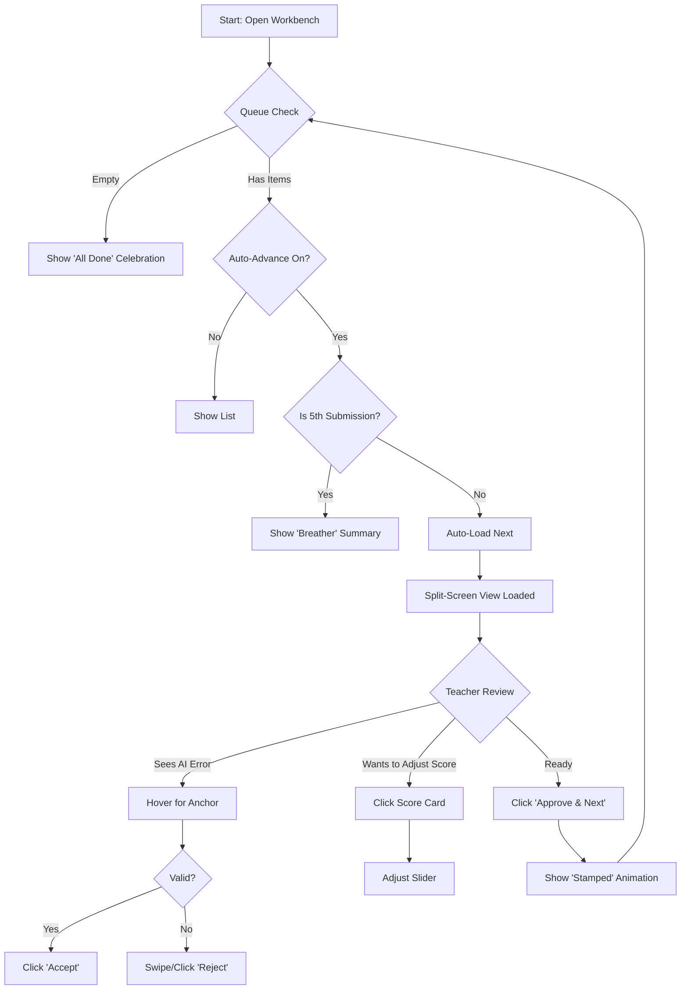
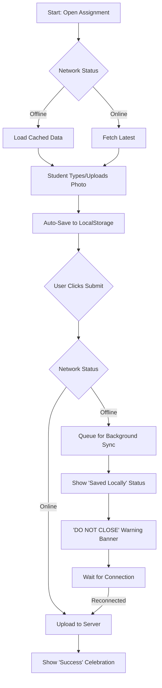
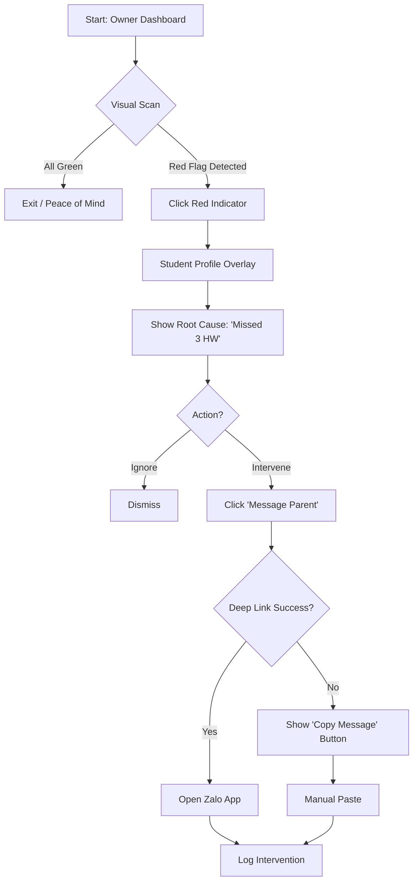

# UX Design Specification classlite

**Author:** Ducdo
**Date:** 2026-01-17

---

## Executive Summary

### Project Vision
ClassLite is a specialized B2B SaaS Learning Management System (LMS) designed for small to medium-sized IELTS centers in Vietnam. It streamlines operations by unifying administrative logistics (scheduling, rosters) and pedagogical delivery (AI-assisted grading, exercise building) into a single "Lite" platform. It aims to replace fragmented tools with an affordable, scalable solution that empowers centers to build their own "Knowledge Hubs" and improving teaching quality through AI-assisted efficiency.

### Target Users
- **Teaching Owner (Primary):** Center owners who also teach. They require instant visibility into business and student health to make data-driven decisions without manual data aggregation.
- **Expert Teacher (Primary):** Experienced educators who value quality but are bogged down by grading. They need AI tools that draft feedback and scores to reduce workload by 50% while maintaining full editorial control.
- **Student (Secondary):** Learners who need a friction-free, mobile-first interface to submit assignments and receive personalized feedback, ensuring high engagement and retention.

### Key Design Challenges
1.  **Balancing Automation with Agency:** The AI Grading Workbench must enhance teacher capabilities without replacing their expertise. Users need to feel in control of the AI's suggestions, viewing it as a drag-and-drop assistant rather than a black-box grader.
2.  **Simplifying Complex Logistics:** Scheduling and roster management involve complex rules (conflict detection, role permissions). The UX must abstract this complexity behind an intuitive, visual interface suitable for non-technical users.
3.  **Mobile Reliability for Students:** ensuring seamless submission experiences on mobile devices, even with unstable internet connections, is critical to prevent student drop-off.

### Design Opportunities
1.  **AI-Assisted Grading Workbench:** A split-screen desktop interface designed for high-speed review cycles ("Review -> Adjust -> Approve"), positioning the product as a productivity multiplier for teachers.
2.  **"Student Health" Traffic Lights:** A high-contrast, immediate dashboard for owners to identify at-risk students (Red/Yellow/Green) at a glance, delivering on the "Time to Insight" promise.
3.  **Methodology Guardian Configuration:** A setup flow that allows Centers to upload "Golden Samples," making the AI feel personalized and "trained" on their specific pedagogical style.
4.  **Class Handoff Protocol:** A dedicated workflow to package class context (student needs, grading style, progress) for substitute teachers, preventing knowledge loss during staff turnover.
5.  **Evidence Anchoring (Trust UI):** Visual connections linking AI scores/corrections directly to specific evidence in the student's submission, making the "black box" transparent and explainable.
6.  **The Celebration Loop:** Micro-interactions and visual rewards for student progress milestones (e.g., band score improvements) to build emotional engagement and retention.

<!-- UX content will be appended sequentially through collaborative workflow steps -->

## Core User Experience

### Defining Experience
The core experience centers on **High-Velocity Pedagogy**. Unlike administrative platforms where the core action is data entry, ClassLite's heartbeat is the **"Review -> Adjust -> Approve"** loop. For teachers, the system is a force multiplier that drafts 80% of the work (grading, content creation), allowing them to focus entirely on the high-value 20% (personalization and coaching). For Owners, the core experience is **"Glanceable Intelligence"**—instant visibility into center health without digging for data.

### Platform Strategy
- **Platform Primary:** Web-based SaaS.
- **Teacher/Admin Context:** Desktop-first (optimized for "Grading Workbench" split-screen efficiency and "Calendar" drag-and-drop).
- **Student Context:** Mobile-first (optimized for on-the-go submission via minimal web interface).
- **Device Capabilities:**
    - **Mobile Camera:** For taking photos of handwritten essays (OCR).
    - **Local Storage:** Robust offline-first auto-save for student submissions on unstable networks.

### Effortless Interactions
- **The "One-Click Accept":** In the Grading Workbench, approving an AI suggestion (score + grammar fix) should be a single click/keystroke.
- **"Login-Free" Feeling:** Student submission flow should feel frictionless. No heavy auth barriers for submitting homework; minimize friction to zero.
- **Smart Scheduling:** Dragging a class to a new slot automatically checks room/teacher conflicts and proposes resolution without opening complex modals.

### Critical Success Moments
- **The "Done by 5 PM" Moment:** A teacher finishes grading a stack of 20 essays in 45 minutes instead of 2 hours, feeling energized rather than drained.
- **The "Rescue" Moment:** An Owner sees a "Red" flag on the Student Health Dashboard, clicks once to see the root cause (missed 3 homeworks), and sends a pre-scripted Zalo message to the parent to prevent churn.
- **The "Saved" Moment:** A student's internet cuts out while submitting an essay, but the "Saved locally" indicator stays green. They submit when connection returns with zero data loss.

### Experience Principles
1.  **AI as Humble Assistant:** The AI proposes, the Expert disposes. Automation is transparent, explainable, and always subservient to the teacher's judgment.
2.  **Complexity behind the Curtain:** We handle the messy logistics (conflict detection, role permissions) invisibly. The user sees only clean choices.
3.  **Unbreakable Mobile Flows:** Student experiences must be bulletproof against network instability.
4.  **Glanceable by Default:** Dashboards and reports should tell the story in 3 seconds (Red/Green), not require analysis.

## Desired Emotional Response

### Primary Emotional Goals
- **Teaching Owner:** **"Clarity & Calm."** The feeling of putting out fires is replaced by looking at a dashboard that says "Everything is under control."
- **Expert Teacher:** **"Respected & Supported."** They shouldn't feel threatened by AI; they should feel like Iron Man putting on the suit—amplified, not replaced.
- **Student:** **"Safe & Seen."** The anxiety of "did it submit?" is gone. The feedback they receive feels personal ("My teacher knows me"), even if drafted by AI.

### Emotional Journey Mapping
1.  **Discovery (Onboarding):** *From "Overwhelmed" to "Relieved".* Setup shouldn't be a 50-step wizard. It should be "Upload your logo, add one class, done."
2.  **Core Loop (Grading):** *From "Dread" to "Flow".* Grading is usually a chore. The Split-Screen Workbench should create a "Flow State" where the teacher gets into a rhythm of approve-approve-edit-approve.
3.  **Completion (Publishing Grades):** *Satisfaction.* Hitting "Publish" shouldn't be scary. It should be a satisfying "Done" moment with visual confirmation that students have been notified.
4.  **Error State (Network Drop):** *Assurance.* Instead of a generic "Network Error" panic, the UI says "Offline Mode Active - We're saving your work locally. Keep going."

### Micro-Emotions
- **Trust:** Built by the "Evidence Anchors". When AI highlights a mistake, underlining the *why* makes the user trust the tool.
- **Delight:** The "Celebration Loop" when a student improves. A subtle animation or encouraging copy adds humanity to the software.
- **Belonging:** For students, seeing their center's logo and their teacher's specific feedback style makes them feel part of a community, not just a row in a database.

### Design Implications
- **Calm UI:** Use ample whitespace, subdued color palettes for admin views (reduce cognitive load), but high-contrast "Traffic Lights" for alerts.
- **Human Tone:** System copy (alerts, empty states) should sound like a helpful colleague, not a robot. "We saved that for you" vs "Data saved".
- **Predictability:** No jumping elements. AI suggestions should fade in gently, not pop up and cover the work.

## UX Pattern Analysis & Inspiration

### Inspiring Products Analysis

#### 1. Duolingo (The Engagement Engine)
*   **Why it works:** Takes the "work" out of learning. It breaks big tasks into tiny, bite-sized interactions that feel like a game.
*   **Key Delight Factors:**
    *   **Sensory Feedback:** The satisfying "Ding!" and haptic vibration when you get an answer right.
    *   **Personality:** The Owl isn't just a logo; it's a character that nags, encourages, and guilt-trips you in a funny, human way.
    *   **Streak Psychology:** The "Don't break the chain" mechanic is a powerful retention hook.

#### 2. Google Classroom (The Utility Standard)
*   **Why it works:** It is invisible. It gets out of the way.
*   **Key Utility Factors:**
    *   **The "Stream":** A single, chronological list of what's happening. No digging.
    *   **Familiarity:** It uses Material Design patterns that users already know from Gmail/Drive, reducing the learning curve to near zero.

### Transferable UX Patterns for ClassLite

**From Duolingo:**
1.  **"Micro-Feedback" Loops (Student View):** When a student submits homework, don't just show a spinner. Give a "Success!" checkmark animation and maybe a playful "You're on fire!" message.
2.  **The "Duo" Tone:** Use slightly playful, encouraging copy in our empty states and alerts. Instead of "No Assignments," say "You're all caught up! Go enjoy the sun."
3.  **Mobile-First Exercises:** The "Manual Exercise Builder" output should look like a Duolingo lesson on mobile—big buttons, clear text, impossible to "fat finger."

**From Google Classroom:**
1.  **The "Classwork" Feed:** Adopt the clean, card-based feed layout for the Student Portal. It’s a pattern they already understand.
2.  **No-Nonsense Attachment Handling:** The way Classroom handles file attachments (preview, click-to-view) is perfect. We should steal that exact interaction model for PDF/Word uploads.

### Anti-Patterns to Avoid
1.  **The "Enterprise ERP" Look:** Avoid dense tables and tiny rows (like Moodle or Blackboard). Keep densities comfortable, like Classroom.
2.  **Aggressive Gamification:** Duolingo can sometimes feel *too* pushy. For B2B/Education, we want *encouragement*, not *annoyance*. Keep the "nagging" respectful.

### Design Inspiration Strategy
**Adopt:** Google Classroom's clean "Feed" architecture for the main navigation.
**Adapt:** Duolingo's "Micro-interactions" for the Grading Workbench. When a teacher approves a grade, give a satisfying visual "Stamp" effect to make grading feel productive and tactile.

## Design System Foundation

### 1.1 Design System Choice
**Foundation:** **shadcn/ui** (Built on Radix Primitives + Tailwind CSS).
**Typography:** **Inter** (for UI density) and **Outfit** (for Headers/Brand personality).
**Iconography:** **Lucide React** (Clean, consistent, standard in the shadcn ecosystem).

### Rationale for Selection
1.  **Speed vs. Quality:** shadcn/ui provides high-fidelity, accessible components (Dialogs, Dropdowns, Calendars) that are "copy-paste" workable immediately, drastically reducing the MVP build time.
2.  **"Lite" Aesthetic:** The default aesthetic is clean, minimalist, and "calm"—perfectly aligning with our "Clarity & Calm" emotional goal.
3.  **React/Next.js Native:** It's the industry standard for modern React apps, meaning easier hiring and community support down the line.

### Implementation Approach
- **Theming:** We will use CSS Variables for the color system to support a potential "Dark Mode" later, though MVP will focus on a "Day Mode" that feels bright and airy.
- **Component Strategy:** We will treat shadcn components as the "Base Layer." We will wrap complex business logic (e.g., `ClassScheduler`) around these primitives rather than building raw HTML/CSS.

### Customization Strategy (The "ClassLite" Feel)
- **Rounded Corners:** We will use slightly larger border-radii (`0.75rem` or `1rem`) to make the UI feel friendly and "bouncy" (like Duolingo) rather than sharp and corporate.
- **Micro-Interactions:** We will add custom `framer-motion` animations to standard shadcn components (e.g., a "pop" effect when checking a task) to deliver the "Celebration Loop."

## 2. Core User Experience (Detailed Mechanics)

### 2.1 Defining Experience: "High-Velocity Pedagogy"
The core interaction is the **Grading Workbench Loop**. It transforms the grading process from "Correction" (fixing errors) to "Review" (validating AI drafts). This shift puts the teacher in a high-level editorial role, doubling their speed.

### 2.2 User Mental Model
*   **Current Model:** Open student file -> Read entire text -> Spot errors manually -> Type comments -> Calculate score. (Mental Load: High).
*   **ClassLite Model:** Open Workbench -> See AI analysis -> Verified "Evidence Anchors" -> Adjust Score -> Approve. (Mental Load: Low).

### 2.3 Success Criteria
*   **Speed:** Time-to-grade per essay < 3 minutes.
*   **Agency:** Teacher overrides AI suggestion in < 2 clicks.
*   **Flow:** "Next Submission" loads in < 500ms (perceived instant).

### 2.4 Novel UX Patterns
*   **Split-Screen Editor-Reviewer:** Unlike standard LMSs (which are form-based), we use a dual-pane IDE-like layout. Left = Student Work, Right = AI Assistant.
*   **Evidence Anchoring:** A visual "tether" line connecting the AI's comment in the Right pane to the specific text in the Left pane when hovered. This builds trust by "showing the work."
*   **"Reject" Action:** A prominent action to dismiss AI suggestions instantly, essential for maintaining trust when the AI hallucinates.

### 2.5 Experience Mechanics
1.  **Initiation:** Teacher opens "Grading Workbench". System auto-loads the first "Ready" submission. No list navigation required.
2.  **Interaction:**
    *   **Review:** Teacher reads student text. AI highlights grammar errors/key points.
    *   **Adjust:** Teacher clicks an AI score (e.g., "6.0") to accept it, or uses a slider to nudge it to "6.5".
    *   **Override:** Teacher highlights text to add a custom comment (AI stays out of the way).
    *   **Reject:** Teacher swipes/clicks "X" on a bad AI suggestion to remove it.
3.  **Feedback:**
    *   **Visual:** "Evidence Anchors" light up on hover to confirm context. If text is edited, anchors detach gracefully ("Orphaned Handling").
    *   **Tactile:** "Approve" button triggers a satisfying "Stamp" animation.
4.  **Completion:**
    *   "Success" micro-interaction plays.
    *   Next submission slides in automatically ("Auto-Advance") via background pre-fetching.

## 3. Visual Design Foundation

### Color System ("Electric Focus")
*   **Primary (Brand):** `Electric Royal Blue` (#2563EB) - Used for primary buttons, active states, and brand moments.
*   **Secondary (Backgrounds):** `Ice Blue Wash` (#EFF6FF) - Used for sidebars and active list item backgrounds to keep the UI feeling airy.
*   **Accent (Action/Attention):** `Focus Amber` (#F59E0B) - Used for "Call to Action" buttons, important warnings, and score highlighters.
*   **Neutral (Text):** `Slate Navy` (#1E293B) - Softer than pure black for better readability and a "friendlier" tone.

### Typography System
*   **Headings:** **Outfit** (Google Font). A geometric sans-serif that feels modern, approachable, and "rounded" to match our "Friendly" tone.
*   **Body/UI:** **Inter** (Google Font). The gold standard for UI legibility at small sizes (perfect for dense grading interfaces).

### Spacing & Layout Foundation ("Spacious & Light")
*   **Density:** **Relaxed.** We will avoid the "Excel Spreadsheet" look. Table rows will have `16px` padding (vs standard `8px`) to let content breathe.
*   **Border Radius:** **`0.75rem` (12px)**. Buttons and cards will have soft, rounded corners to echo the "Feather" curves.
*   **White Space:** We will use the "Ice Blue Wash" to create distinct zones without heavy borders, using **Proximity** over **Lines** to group information.

### Logomark
*   **The Feather:** Symbolizing "Lightweight" and "Writing". It will appear in the top-left navigation and as the loading spinner (a writing feather animation).

## 4. Design Direction Decision

### Design Directions Explored
1.  **The Cockpit:** High-density, split-screen, power-user focus. Good for speed but visually overwhelming.
2.  **Zen Garden:** Ultra-minimal, single-column focus. Good for writing but hides tools too much.
3.  **Intelligent Hybrid:** Balanced layout with distinct zones for reading and tools.

### Chosen Direction
**Direction 3: The Intelligent Hybrid**

### Design Rationale
*   **Best of Both Worlds:** It combines the "Calm" of Zen Garden (clean reading typography) with the "Speed" of Cockpit (persistent sidetools).
*   **Scalability:** The sidebar structure allows adding more AI tools (e.g., "Deep Analysis", "Plagiarism Check") without cluttering the main view.
*   **Mental Mode:** It aligns with the "Reviewer" mental model—the text is center stage, but the assistant is always at the right hand, ready to help.

### Implementation Approach
*   **Layout:** 3-Column Grid (Navigation Rail | Main Content | AI Sidebar).
### Implementation Approach
*   **Layout:** 3-Column Grid (Navigation Rail | Main Content | AI Sidebar).
*   **Responsive:** On mobile, the Navigation Rail becomes a bottom bar, and the AI Sidebar becomes a bottom sheet/drawer.

## 5. User Journey Flows

### 5.1 Teacher Grading Flow ("The 3-Minute Loop")
This flow minimizes clicks but prevents "conveyor belt fatigue" with smart pauses.

### 5.2 Student Submission Flow ("Offline-Proof")
Includes critical safeguards for data loss on unstable connections.

### 5.3 Owner Insight Flow ("3 Clicks to Rescue")
Includes fallbacks for cross-platform messaging reliability.

### Flow Optimization Principles
1.  **Safeguards over Speed:** In offline states, we prioritize *warnings* ("Don't Close") over cleanliness.
2.  **Platform Resilience:** We assume external links (Zalo) will fail and always provide a manual "Copy" fallback.
3.  **Human Pacing:** We interrupt the "Auto-Advance" loop periodically to prevent teacher fatigue.

## 6. Component Strategy

### Design System Components (shadcn/ui Foundation)
We will leverage these existing primitives to move fast:
*   `Sheet`: For the collapsible "AI Sidebar" in the Grading Workbench.
*   `Dialog`: For "Emergency" alerts (e.g., "Confirm Delete").
*   `Slider`: For fine-tuning scores.
*   `Badge`: For status indicators (e.g., "Band 6.0", "Pending").
*   `Toast`: For lightweight success feedback ("Saved").

### Custom Components (The "ClassLite" Experience)
These unique components require custom development to deliver the core value.

#### 1. `GradingEditor`
*   **Purpose:** The core workspace for the "Review -> Adjust -> Approve" loop.
*   **Anatomy:** Split-screen container (resizable). Left: `ProseMirror` (Rich Text). Right: AI Card List.
*   **Technical Constraint (Reach-Text Logic):** Requires a "Range Adapter" layer. If the teacher edits text (changing character offsets), the adapter must gracefully detach or shift the AI comments so they don't point to the wrong words.

#### 2. `ConnectionLine` (The Trust Anchor)
*   **Purpose:** Visually connects an AI comment to the specific text evidence.
*   **Implementation:** An SVG layer overlaying the `GradingEditor`. Draws a bezier curve from the `Editor` range rect to the `AI Card` rect.
*   **Performance Constraint:** Render ONLY the *active* line (hovered). Rendering 50+ lines simultaneously will degrade scroll performance.
*   **Mobile Fallback:** On mobile, disable lines entirely. Use color-coded text highlighting instead to prevent occlusion.

#### 3. `OfflineIndicator` (The Safeguard)
*   **Purpose:** Critical warning to prevent data loss.
*   **States:**
    *   *Saving:* Rotating "Feather".
    *   *Saved:* Green Checkmark.
    *   *Offline:* Amber "Cloud with Slash" icon + Sticky Banner ("Do Not Close Tab").

### Implementation Roadmap
**Phase 1 (The Core Loop):** `GradingEditor` + `ConnectionLine`. Essential for the MVP "Grading Workbench".
**Phase 2 (Feedback):** `ScoreDial` (Tactile input) + `CelebrationOverlay` (Confetti/Stamp animation).
**Phase 2 (Feedback):** `ScoreDial` (Tactile input) + `CelebrationOverlay` (Confetti/Stamp animation).
**Phase 3 (Dashboard):** Complex charts for "Student Health".

## 7. UX Consistency Patterns

### Feedback Patterns ("The No-Nag Rule")
*   **Success (Passive):** We never interrupt flow for routine success. When a grade is saved, show a **Toast** (bottom-right) or a subtle **Checkmark Animation** inline.
*   **Error (Active):** Inline validation for forms. If the AI service fails, show a "Retry" button contextually in the AI Sidebar.
*   **Critical (Blocking):** Only for data loss risks. If "Offline" and the user tries to close the tab, use a **Sticky Banner** or `beforeunload` dialog.
*   **Exception ("Anxiety Relief"):** For irreversible actions like "Publish Grades", we *do* use a modal. Users want a moment of friction to confirm they are ready to broadcast scores.

### Navigation Patterns ("Context Preservation")
*   **Deep Dives as Overlays:** Clicking a student in the list opens the "Grading Workbench" as a **Full Screen Overlay** (z-index layer) over the Dashboard.
*   **URL Sync:** The Overlay must update the URL (e.g., `/class/1/student/5`) so refreshing the page restores the exact state (Overlay over Dashboard).

### Form Patterns ("Click-to-Edit")
*   **Grading Inputs:** In the workbench, fields like "Score" or "Comments" appear as plain text/badges. They only become inputs on **Hover/Focus**.
*   **Accessibility Constraint:** These invisible inputs must have a prominent **Focus Ring** (`outline-primary`) when accessed via keyboard (Tab) so users know they are editable.

### Design System Integration
*   **Dialogs:** We use `shadcn/ui` Dialogs but strip the default "backdrop blur" to `bg-black/20` to keep it feeling lighter ("Lite" brand).
### Design System Integration
*   **Dialogs:** We use `shadcn/ui` Dialogs but strip the default "backdrop blur" to `bg-black/20` to keep it feeling lighter ("Lite" brand).
*   **Loaders:** We replace standard spinners with our custom "Writing Feather" animation.

## 8. Responsive Design & Accessibility

### Responsive Strategy
*   **Teacher/Owner (Desktop-First):** The complex "Grading Workbench" and "Dashboard" are optimized for **1440px+** screens.
    *   *Tablet Adaptation:* The "AI Sidebar" collapses into a drawer button to preserve the main reading area.
*   **Student (Mobile-First):** The "Submission" and "Home" views are single-column, touch-optimized experiences targetting **375px+** devices. We assume students will check grades on their phones.

### Breakpoint Strategy
*   **Mobile (< 768px):** Navigation moves to Bottom Bar. Workbench "Split View" becomes "Stacked View" (Text | Tools).
*   **Tablet (768px - 1024px):** Sidebar collapses.
*   **Desktop (> 1024px):** Full 3-column layout.

### Accessibility Strategy (WCAG AA)
*   **Keyboard Navigation (Power User Efficiency):**
    *   Teachers must be able to drive the entire grading loop using keyboard shortcuts (`Cmd+Enter` to approve, `Tab` to next input).
    *   "Invisible" inputs must have prominent **Focus Rings**.
*   **Screen Readers:**
    *   The "Connection Lines" are purely visual and should be hidden from screen readers (`aria-hidden="true"`).
    *   The association between text and comment must be programmatic (`aria-details="comment-id"`).

### Testing Strategy
*   **Device Lab:** Verify the "Student Submission" flow on actual low-end Android devices (common in target market).
*   **Keyboard Audit:** Ensure the "Grading Loop" has no focus traps.
